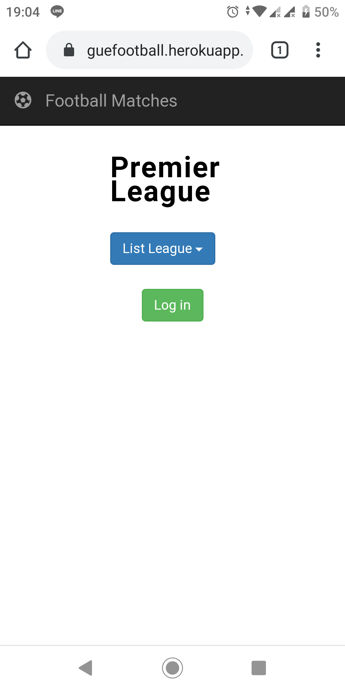
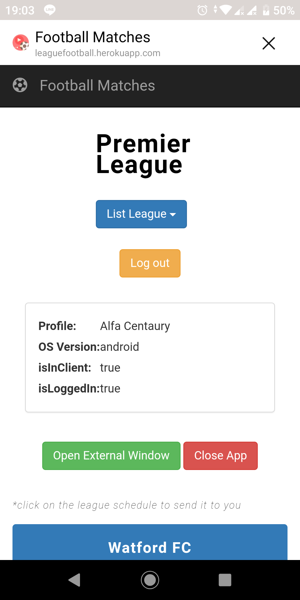
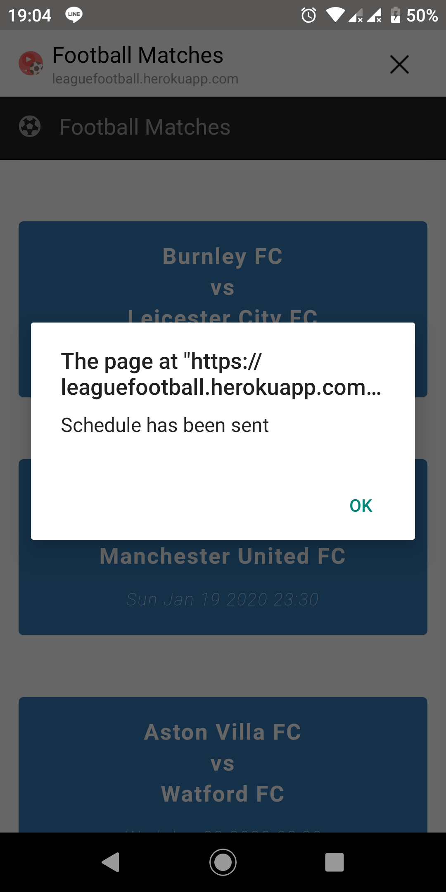

# Learned Membangun LINE Front-end Framework Academy Dicoding

This repository explains about learning to build applications using the LINE Front-end Framework. Football Match application that displays competition schedules in several countries using the API [Football-data.org](https://www.football-data.org).

  
  
  

 
 

#### The repository has following packages:

1. **assets**: It contains all images for README.
2. **css**: Implement the use of styles in the application.
3. **js**: Implementation of all services in the application.

### Library reference resources:

1. LINE Front-end Framework: https://developers.line.biz/en/
2. Bootstrap: https://getbootstrap.com/docs/3.4/
3. jQuery: https://developers.google.com/speed/libraries
4. Font Awesome: https://fontawesome.com/

## Noted

Please use this as a reference only. Hope this helps you develop more projects.
